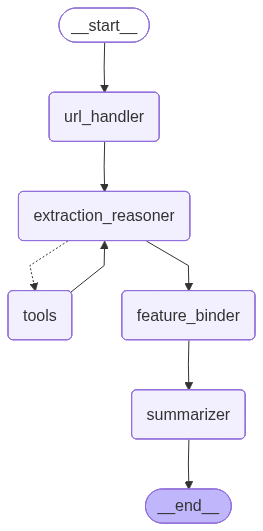

# Langscrape: LLM-Powered HTML Extraction

Langscrape is a lightweight agentic pipeline for extracting structured data from raw HTML using Large Language Models (LLMs) and helper tools.  
It combines **robust scraping** (via Patchright), **LLM reasoning**, and **XPath-based extraction** into a simple, extensible framework.

---

## 📦 Project Overview

The flow of the system can be visualized as:



1. **`html_fetcher`**  
   A robust scraping node, using [Patchright](https://github.com/Kaliiiiiiiiii-Vinyzu/patchright-python) (a stealthy Playwright fork) to fetch HTML from **any website**, passing anti-bot protection.

2. **`llm`**  
   The central reasoning component. The LLM analyzes the HTML and decides how to extract the required information. It can:
   - Call **tools** (currently: XPath extractor).
   - Produce structured outputs for downstream use.

3. **`tools` (XPath Extractor)**  
   Based on the approach in [*XPath Agent: An Efficient XPath Programming Agent Based on LLM for Web Crawler*](https://arxiv.org/html/2502.15688v1). In this method, the LLM proposes candidate XPath selectors, we evaluate them against the DOM, and    iteratively refine until the desired data is extracted.  
   This enables:
   - Minimal LLM token usage → **fast and cost-efficient**
   - Reduced hallucinations

4. **`output_formatter`**  
   Converts extracted data into clean, structured outputs (e.g., JSON or Python dicts; extensible to CSV or databases).

## Installation

```console
git clone https://github.com/DelmedigoA/langscrape
cd langscrape
python -m venv .env
source .env/bin/activate
pip install -e .
bash setup.sh
python3 test.py
```
