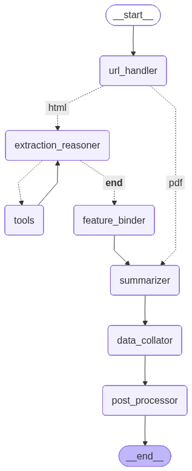

# Langscrape: LLM-Powered HTML Extraction

Langscrape is a lightweight agentic pipeline for extracting structured data from raw HTML using Large Language Models (LLMs) and helper tools.  
It combines **robust scraping** (via Patchright), **LLM reasoning**, and **XPath-based extraction** into a simple, extensible framework.

---

## 📦 Project Overview

The flow of the system can be visualized as:

1. **`html_fetcher`**  
   A robust scraping node, using [Patchright](https://github.com/Kaliiiiiiiiii-Vinyzu/patchright-python)  
   (a stealthy Playwright fork) to fetch HTML from **any website**, including those with JavaScript-heavy  
   content and basic anti-bot protection.

2. **`llm`**  
   The central reasoning component. The LLM analyzes the HTML and decides how to extract the required information.  
   It can:
   - Call **tools** (currently: XPath extractor).
   - Pass structured results forward.

3. **`tools` (XPath Extractor)**  
   Based on the approach in  
   [*XPath Agent: An Efficient XPath Programming Agent Based on LLM for Web CrawlerXPath Agent: An Efficient XPath Programming Agent Based on LLM for Web Crawler* (arXiv:2502.15688v1)](https://arxiv.org/html/2502.15688v1).  
   In this method, the LLM proposes candidate XPath selectors,  
   we evaluate them against the DOM, and iteratively refine until the desired data is extracted.  
   This enables:
   - Minimal LLM token usage → **fast and cost-efficient**
   - Robust generalization across websites

4. **`output_formatter`**  
   Normalizes the LLM output into a clean structured format (e.g., JSON or dict).  
